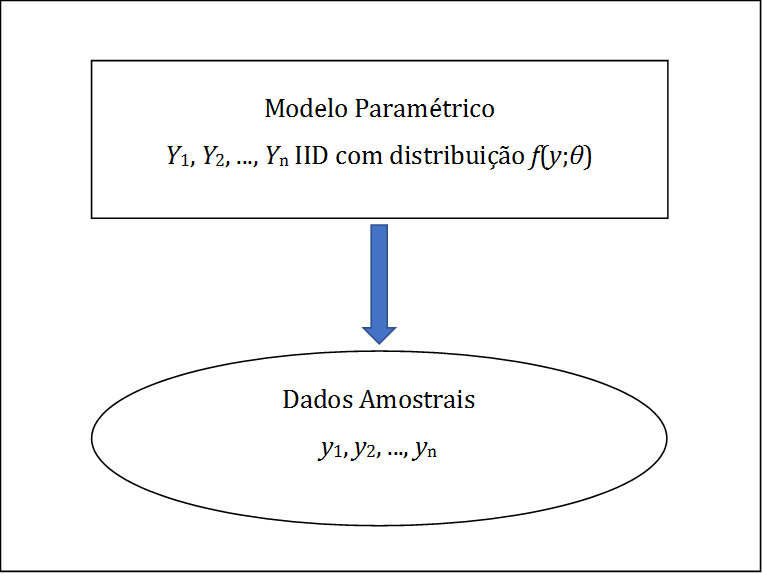
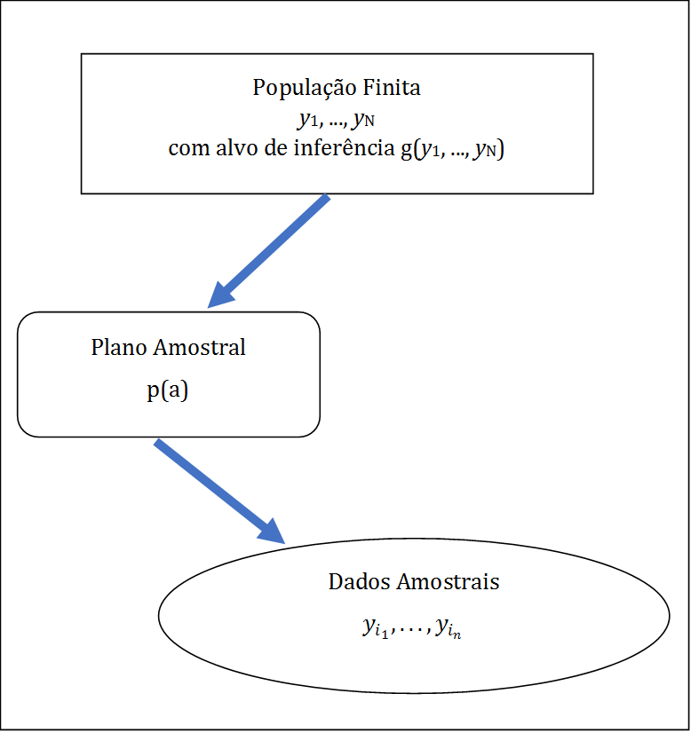
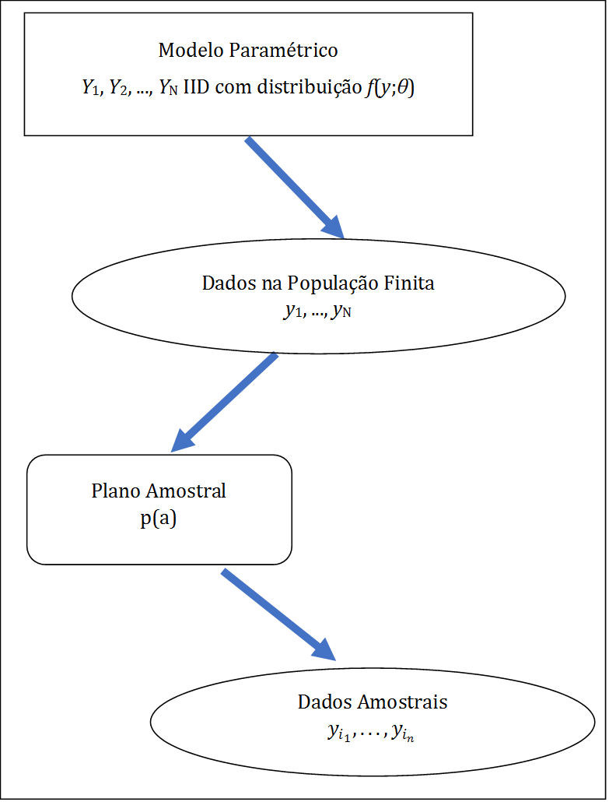

---
output:
  pdf_document: default
  html_document: default
---
# Referencial para Inferência {#refinf}

## Modelagem - Primeiras Ideias {#classic}

Com o objetivo de dar uma primeira ideia sobre o assunto a ser tratado neste livro vamos considerar, numa situação simples, algumas abordagens alternativas para modelagem e análise estatística.

### Abordagem 1 - Modelagem Clássica 

Seja $Y$ um vetor $P \times 1$ de variáveis de pesquisa (ou de interesse), e sejam $n$ vetores de observações destas variáveis para uma amostra de unidades de interesse denotados por $y_1, \ldots ,y_n$. Em Inferência Estatística, a abordagem que aqui chamamos de _Modelagem clássica_ considera $y_1, \ldots ,y_n$ como valores (realizações) de vetores de variáveis aleatórias $Y_1, \ldots ,Y_n$. 

Podemos formular modelos bastante sofisticados para a distribuição conjunta destes vetores aleatórios, mas para simplificar a discussão, vamos inicialmente supor que $Y_1, \ldots ,Y_n$ são vetores aleatórios independentes e identicamente distribuídos (IID), com a mesma distribuição de $Y$, caracterizada pela função de densidade ou de frequência $f(y;\theta)$, onde $\theta \in \Theta$ é o parâmetro (um vetor de dimensão $K \times 1$) indexador da distribuição $f$, e $\Theta$ é o espaço paramétrico. A partir das observações $y_1, \ldots ,y_n$, são feitas inferências a respeito do parâmetro $\theta$. 

Uma representação gráfica esquemática dessa abordagem é apresentada na Figura \@ref(fig:modclas), e uma descrição esquemática resumida é apresentada na Tabela \@ref(tab:modelclass).

 

-------------------   ----------------------------------------------
Dados Amostrais       $Y_1=y_1, \ldots, Y_n=y_n$

Modelo Paramétrico/   $Y_1, \ldots ,Y_n$ variáveis aleatórias IID
Hipóteses             com distribuição $f(y,\theta)$,
                      onde $\theta \in \Theta$

Objetivo              Inferir sobre $\theta$ usando as
                      observações $y_1, \ldots ,y_n$
------------------    -----------------------------------------------

Table: (#tab:modelclass) Representação esquemática da abordagem _Modelagem Clássica_.

Do ponto de vista matemático, o parâmetro $\theta$ serve para indexar os elementos da família de distribuições $\left\{f\left( y;\theta \right);\theta \in \Theta \right\}$. Na prática, as
questões relevantes da pesquisa são traduzidas em termos de perguntas sobre o valor ou região 
a que pertence o parâmetro $\theta$, e a inferência sobre $\theta$ a partir dos
dados ajuda a responder tais questões. 

Esta abordagem é útil em estudos analíticos tais como, por exemplo, na investigação da natureza da associação entre variáveis (modelos de regressão linear ou logística, modelos log-lineares, etc.). Vários exemplos discutidos ao longo dos Capítulos \@ref(modreg), \@ref(testqualajust) e \@ref(testetab2) ilustram situações deste tipo. No Capítulo \@ref(estimacao-de-densidades) o foco vai ser a estimação não paramétrica da forma da função $f(y;\theta)$. 

Inferência sob modelos do tipo descrito nesta seção forma o conteúdo de um curso introdutório de inferência estatística. Mais detalhes podem ser consultados, por exemplo, em [@Casella] e [@Marcos].

### Abordagem 2 - Amostragem Probabilística

A abordagem adotada pelos praticantes de _Amostragem Probabilística_ (amostristas) considera
uma população finita $U=\{1, \ldots ,N\}$, da qual é selecionada
uma amostra $a=\left\{ i_{1}, \ldots ,i_{n}\right\}$, segundo um plano
amostral caracterizado por $p\left( a\right)$, probabilidade de ser
selecionada a amostra $a$, suposta calculável para todas as
possíveis amostras. Os valores $y_{1}, \ldots ,y_{N}$ das variáveis
de interesse $Y$ na _população finita_ são considerados fixos, porém desconhecidos.

A partir dos valores observados na amostra $a$, denotados por $y_{i_1}, \ldots, y_{i_n}$, são feitas inferências a respeito de funções dos valores populacionais, digamos $g\left( y_{1}, \ldots , y_{N}\right)$. Os valores de tais funções são quantidades descritivas populacionais (QDPs), também denominadas _parâmetros da população finita_ pelos amostristas. Em geral, o objetivo desta abordagem
é fazer estudos descritivos utilizando funções $g$ particulares, tais como totais 
$g\left( y_{1}, \ldots , y_{N}\right) = \sum_{i=1}^{N} y_{i}$ ,
médias $g\left( y_{1}, \ldots , y_{N}\right) = N^{-1}\sum_{i=1}^{N} y_{i}$,
proporções, razões, etc. Uma descrição esquemática resumida dessa abordagem é apresentada na Tabela  \@ref(tab:modelamo), e uma representação gráfica resumida na Figura \@ref(fig:modamo).

 

-------------------   ----------------------------------------------
Dados Amostrais       $Y_1=y_{i_1}, \ldots, Y_n=y_{i_n}$

Hipóteses/Modelo      extraídos de $y_1, \ldots , y_N$ segundo $p(a)$
Hipóteses

Objetivo              Inferir sobre funções $g(y_1, \ldots , y_N)$
                      usando $y_{i_1}, \ldots, y_{i_n}$
------------------    -----------------------------------------------

Table: (#tab:modelamo) Representação esquemática da abordagem _Amostragem Probabilística_.

Esta abordagem é largamente empregada na produção de estatísticas públicas e oficiais, 
por agências e instituições de muitos países. Uma das alegadas vantagens dessa abordagem
é o fato de que as distribuições de referência usadas para inferência são controladas 
pelos amostristas que planejam as pesquisas por amostragem, e portanto, a inferência 
pode ser considerada não paramétrica e não dependente de modelos que precisariam ser 
especificados pelo analista.

### Discussão das Abordagens 1 e 2

A primeira abordagem ( _Modelagem Clássica_ ), nos termos descritos, foi inicialmente
proposta para dados de medidas na Física e Astronomia, onde em geral 
o pesquisador tem relativo controle sobre os experimentos, e onde faz
sentido falar em replicação ou repetição do experimento. Neste contexto, a ideia 
de aleatoriedade é geralmente introduzida para modelar os erros (não controláveis) 
do processo de medição, e as distribuições de estatísticas de interesse são derivadas 
a partir da _distribuição do modelo_ especificado.

A segunda abordagem ( _Amostragem Probabilística_ ) é utilizada
principalmente no contexto de estudos socioeconômicos observacionais, para
levantamento de dados por agências governamentais produtoras de 
informações estatísticas. Nesta abordagem, a aleatoriedade é
introduzida pelo pesquisador no processo para obtenção dos dados,
através do _planejamento amostral_ $p(a)$ utilizado [@Neyman] e as 
distribuições das estatísticas de interesse são derivadas a partir dessa
_distribuição de aleatorização_. 

Os planos amostrais podem ser complexos, gerando observações afetadas pelas
características i) a iv) mencionadas no Capítulo \@ref(introduc). Os dados obtidos são
utilizados principalmente para descrição da população finita, mediante o cálculo de
estimativas de _parâmetros descritivos_ usuais tais como totais, médias, 
proporções, razões, etc. Sob a abordagem de _Amostragem Probabilística_, os pontos i) a iv) 
do Capítulo \@ref(introduc) são devidamente considerados tanto na estimação dos parâmetros 
descritivos como também na estimação de variâncias dos estimadores, permitindo a
inferência pontual e por intervalos de confiança baseada na distribuição assintótica 
normal dos estimadores habitualmente considerados.

A abordagem de _Amostragem Probabilística_ é essencialmente não-paramétrica, pois não
supõe uma distribuição paramétrica particular para as observações
da amostra. Por outro lado, essa abordagem tem a desvantagem de
fazer inferências restritas à particular população finita considerada.

Apesar da abordagem de _Amostragem Probabilística_ ter sido inicialmente concebida 
e aplicada para problemas de inferência descritiva sobre populações finitas, é
cada vez mais comum, porém, a utilização dos dados obtidos através de pesquisas 
amostrais complexas para fins analíticos, com a aplicação de métodos de análise 
desenvolvidos e apropriados para a abordagem de _Modelagem Clássica_. Nesse contexto, 
é relevante considerar algumas questões de interesse.

- É adequado aplicar métodos de análise da _Modelagem Clássica_, 
concebidos para observações IID, aos dados obtidos através de
pesquisas amostrais complexas?

- Em caso negativo, seria possível corrigir estes métodos,
tornando-os aplicáveis para tratar dados amostrais complexos?

- Ou seria mais adequado fazer uso analítico dos dados dentro da abordagem 
de _Amostragem Probabilística_? E neste caso, como fazer isto, visto que nesta 
abordagem não é especificado um modelo para a distribuição das
variáveis de pesquisa _na população_?

Além destas questões, também é de interesse a questão da robustez da
inferência, traduzida nas seguintes perguntas.

- O que acontece quando o modelo adotado na _Modelagem Clássica_ não
é verdadeiro?

- Neste caso, qual a interpretação dos parâmetros na _Modelagem Clássica_?
- Ainda neste caso, as quantidades descritivas populacionais 
da _Amostragem Probabilística_ poderiam ter alguma utilidade ou interpretação?

O objeto deste livro é exatamente discutir respostas para as
questões aqui enumeradas. Para isso, vamos considerar uma abordagem que
propõe um modelo parametrizado como na _Modelagem Clássica_, mas formulado para 
descrever os dados da população, e não os da amostra. Além disso,
essa abordagem incorpora na análise os pontos i) a iii) do Capítulo \@ref(introduc)
mediante aproveitamento da estrutura do planejamento amostral, como feito 
habitualmente na _Amostragem Probabilística_. Essa abordagem, denominada de 
_Modelagem de Superpopulação_, foi primeiro proposta em [@Brewer1963] e [@royall], e é bem descrita, 
por exemplo, em [@binder83] e [@valliant].

### Abordagem 3 - Modelagem de Superpopulação {#modelsuperpop}

Nesta abordagem, os valores $y_{1}, \ldots ,y_{N}$ das variáveis de
interesse $Y$ na população finita são considerados observações ou realizações 
dos vetores aleatórios $Y_{1}, \ldots , Y_{N}$, supostos IID com distribuição 
$f(y;\theta)$, onde $\theta \in \Theta$. Este modelo é denominado `Modelo de Superpopulação`. 
Note que, em contraste com o que se faz na _Modelagem Clássica_, o modelo probabilístico 
é aqui especificado para descrever o mecanismo aleatório que gera a _população_, 
não a amostra. Na maioria das aplicações práticas, a população de interesse, embora 
considerada finIta, jamais será observada por inteiro. Não obstante, ao formular o modelo 
para descrever propriedades da população, nossas perguntas e respostas descritas 
em termos de valores ou regiões para o parâmetro $\theta$ passam a se referir à 
população de interesse ou a populações similares, quer existam ao mesmo tempo, 
quer se refiram a estados futuros (ou passados) da mesma população. Vale realçar também
que pesquisas por amostragem "consistem em selecionar parte de uma população para observar, 
de modo que seja possível estimar alguma coisa sobre toda a população”, conforme [@thompson].

Utilizando um plano amostral definido por $p(a)$, obtemos os valores das variáveis de 
pesquisa na amostra $y_{i_1}, \ldots , y_{i_n}$. A partir de $y_{i_1}, \ldots , y_{i_n}$, 
em geral não considerados como observações de vetores aleatórios IID, queremos fazer 
inferência sobre o parâmetro $\theta$, considerando os pontos i) a iii) do Capítulo 1. 
Veja uma representação gráfica resumida desta abordagem na Figura \@ref(fig:modsup).

 

Adotando o _Modelo de Superpopulação_ e considerando métodos
usuais disponíveis na _Modelagem Clássica_, podemos utilizar funções
de $y_{1}, \ldots ,y_{N}$ , digamos $g( y_{1}, \ldots , y_{N})$, 
para fazer inferência sobre $\theta$. Desta forma, definimos estatísticas 
$\left( y_{1},\ldots ,y_{N}\right)$ (no sentido da _Modelagem Clássica_) 
que são quantidades descritivas populacionais (parâmetros populacionais no 
contexto da _Amostragem Probabilística_), que passam a ser os novos parâmetros-alvo. 
O passo seguinte é utilizar métodos disponíveis na _Amostragem Probabilística_ para
fazer inferência sobre $g\left( y_{1}, \ldots , y_{N}\right)$ baseada em 
$y_{i_1},\ldots ,y_{i_n}$. Note que não é possível basear a inferência nos valores
populacionais $y_{1}, \ldots , y_{N}$, já que estes não são conhecidos ou observados. 
Este último passo adiciona a informação sobre o plano amostral utilizado, 
contida em $p(a)$, à informação estrutural contida no modelo 
$\left\{ f\left( y; \theta \right) ;\theta \in \Theta\right\}$. 
Uma representação esquemática dessa abordagem é apresentada na Tabela \@ref(tab:modelsuperpop).

-------------------   ----------------------------------------------
Dados Amostrais       $Y_1=y_{i_1},\ldots,Y_n=y_{i_n}$

População e           Extraídos de $y_1,\dots,y_N$ segundo $p(a)$
esquema de seleção

Modelo para           $Y_1, \dots, Y_N$ variáveis aleatórias IID
poulação              com distribuição $f(y,\theta)$, onde $\theta \in \Theta$

Parâmetro-alvo        associar $\theta \longleftrightarrow g\left(Y_{1}, \ldots , Y_{N}\right)$

Objetivo              Inferir sobre $g\left( Y_{1}, \ldots , Y_{N}\right)$ partir de
                      $y_{i_1},\ldots,y_{i_n}$ usando $p\left( a\right)$
------------------    -----------------------------------------------

Table: (#tab:modelsuperpop) Representação esquemática da _Modelagem de Superpopulação_.

A descrição da abordagem adotada neste livro foi apresentada de
maneira propositalmente simplificada e vaga nesta seção, mas será aprofundada
ao longo do texto. Admitiremos que o leitor esteja familiarizado com a 
_Modelagem Clássica_ e com as noções básicas da _Amostragem Probabilística_. A
título de recordação, serão apresentados no Capítulo \@ref(planamo)
alguns resultados básicos da _Amostragem Probabilística_. A ênfase do
texto, porém, será na apresentação da _Modelagem de Superpopulação_,
sendo para isto apresentados os elementos indispensáveis das 
abordagens de _Modelagem Clássica_ e da _Amostragem Probabilística_.

Ao construir e ajustar modelos a partir de dados de pesquisas amostrais
_complexas_, tais como as executadas pelo IBGE e outras instituições similares, 
o usuário precisa incorporar as informações sobre pesos e sobre a estrutura dos 
planos amostrais utilizados. Em geral, ao publicar os resultados das pesquisas, 
os pesos são considerados, sendo possível produzir estimativas pontuais _corretas_
utilizando os pacotes tradicionais. Por outro lado, para construir
intervalos de confiança e testar hipóteses sobre parâmetros de
modelos, seria preciso o conhecimento das estimativas de variâncias e
covariâncias das estimativas, obtidas levando em conta a estrutura do plano amostral
utilizado. Mesmo conhecendo o plano amostral, geralmente não é
simples incorporar pesos e plano amostral na análise sem o uso de
pacotes especializados, ou de rotinas específicas já agora disponíveis em alguns 
dos pacotes mais comumente utilizados (por exemplo, SAS, Stata, SPSS, ou R entre outros). 
Tais pacotes especializados ou rotinas específicas utilizam, em geral, métodos 
aproximados para estimar matrizes de covariância. Entre esses métodos, destacam-se
o de Máxima Pseudo-Verossimilhança, a Linearização, o método do Conglomerado Primário,
e métodos de reamostragem, que serão descritos mais adiante.

Em outras palavras, o uso dos pacotes usuais para analisar dados produzidos
por pesquisas com planos amostrais complexos, tal como o uso de muitos
remédios, pode ter contra-indicações. Cabe ao usuário _ler a bula_ e identificar situações 
em que o uso de tais pacotes pode ser inadequado, e buscar opções de rotinas específicas
ou de pacotes especializados capazes de incorporar adequadamente a estrutura do plano 
amostral nas análises. 

Ao longo deste livro faremos uso intensivo do pacote `survey` disponível no R, mas o leitor
encontrará funcionalidade semelhante em vários outros pacotes. Nossa escolha se deveu a dois 
fatores principais: primeiro ao fato do pacote R ser aberto, livre e gratuito, dispensando o 
usuário de custos de licenciamento, bem como possibilitando aos interessados o acesso ao
código fonte e à capacidade de modificar as rotinas de análise, caso necessário. O segundo 
fator é de natureza mais técnica, porém transitória. No presente momento, o pacote `survey` 
é a coleção de rotinas mais completa e genérica existente para análise de dados amostrais 
complexos, dispondo de funções capazes de ajustar os modelos usuais, mas também de ajustar 
modelos não convencionais, mediante a maximização numérica de verossimilhanças especificadas 
pelo usuário. Sabemos, entretanto, que muitos usuários habituados à facilidade de uso de pacotes com 
interfaces gráficas do tipo _aponte e clique_ terão dificuldade adicional de adaptar-se 
à linguagem de comandos utilizada pelo pacote R, mas acreditamos que os benefícios do 
aprendizado desta nova ferramenta compensarão largamente os custos adicionais do aprendizado.

O emprego de ferramentas de análise como o pacote `survey` permitirá aos usuários focar
sua atenção mais na seleção, análise e interpretação dos modelos ajustados do que nas
dificuldades técnicas envolvidas nos cálculos correspondentes. É com este espírito que
escrevemos este texto, que busca apresentar os métodos, ilustrando seu uso com exemplos
reais, e orientando sobre o uso adequado das ferramentas de modelagem e análise 
disponíveis no sistema R.

## Fontes de Variação

Esta seção estabelece o referencial para inferência em pesquisas amostrais 
que será usado no restante deste texto. [@cassel] sugerem que um referencial 
para inferência poderia considerar três fontes de aleatoriedade (incerteza, variação), 
incluindo:

1. _Modelo de Superpopulação_, que descreve o processo subjacente que, por hipótese,
gera as medidas verdadeiras para todas as unidades da população considerada;

2. _Processo de Medição_, que diz respeito aos instrumentos e métodos usados para 
obter as medidas de qualquer unidade da população;

3. _Planejamento Amostral_, que estabelece o mecanismo pelo qual unidades da população 
são selecionadas para participar da amostra da pesquisa ou estudo.

Uma quarta fonte de incerteza que precisa ser acrescentada às anteriores é o

4. _Mecanismo de resposta_, ou seja, o mecanismo que controla se valores de 
medições de unidades selecionadas para a amostra são obtidos / observados ou não.

Para concentrar o foco nas questões de maior interesse deste texto, as fontes
(2) e (4) não serão consideradas no referencial adotado para a maior parte dos capítulos. 
Para o tratamento das dificuldades causadas por não resposta, a fonte (4) será considerada
no capítulo onze. Assim sendo, exceto onde explicitamente indicado, de agora em diante 
admitiremos que não há _erros de medição_, implicando que os valores observados de 
quaisquer variáveis de interesse serão considerados valores corretos ou verdadeiros. 
Admitiremos ainda que há _resposta completa_, implicando que os valores de quaisquer 
variáveis de interesse estão disponíveis para todos os elementos da amostra selecionada
depois que a pesquisa foi realizada. Hipóteses semelhantes são adotadas, por exemplo, 
em [@binder83] e [@Mont87].

Portanto, o referencial aqui adotado considera apenas duas fontes
alternativas de variação: o _Modelo de Superpopulação_ (1) e o
_Plano Amostral_ (3). Estas fontes alternativas de variação, descritas
nesta seção apenas de forma esquemática, são discutidas com maiores detalhes a seguir.

A fonte de variação (1) será considerada porque usos analíticos das pesquisas são 
amplamente discutidos neste texto, os quais só têm sentido quando é especificado um 
modelo estocástico para o processo subjacente que gera as medidas na população. 
A fonte de variação (3) será considerada porque a atenção será focalizada na análise 
de dados obtidos através de pesquisas amostrais complexas. Aqui a discussão se 
restringirá a planos amostrais aleatorizados ou de _Amostragem Probabilística_, 
não sendo considerados métodos intencionais ou outros métodos não-aleatórios 
algumas vezes usados para seleção de amostras.

## Modelos de Superpopulação

Seja $\{1, ..., N\}$ um conjunto de rótulos que identificam univocamente
os $N$ elementos distintos de uma população-alvo finita $U$. Sem
perda de generalidade tomaremos $U=\{1,...,N\}$. Uma pesquisa cobrindo $n$
elementos distintos numa amostra $a$, $a=\{i_{1},...,i_{n}\}\subset U$,
é realizada para medir os valores de $P$ variáveis de interesse da
pesquisa, doravante denominadas simplesmente _variáveis da pesquisa_.

Denotaremos por $\mathbf{y}_i=(y_{i1},...,y_{iP})^{\prime }$ o vetor $P\times 1$ 
de valores das variáveis da pesquisa e por $\mathbf{x}_{i}=(x_{i1},...,x_{iQ})^{\prime }$ 
o vetor $Q\times 1$ de variáveis auxiliares da i-ésima unidade da população, 
respectivamente, para $i=1,...,N$. Aqui as variáveis auxiliares são consideradas 
como variáveis contendo a informação requerida para o planejamento amostral e a 
estimação a partir da amostra, como se discutirá com mais detalhes adiante. 
Denote por $\mathbf{y}_{U}$ a matriz $N \times P$ formada empilhando os vetores 
transpostos das observações das variáveis de pesquisa correspondentes a todas as 
unidades da população, e por $\mathbf{Y}_{U}$ a correspondente matriz de vetores 
aleatórios geradores das observações na população.

Quando se supõe que $\mathbf{y}_1 ,\ldots, \mathbf{y}_N$ são a realização
conjunta de vetores aleatórios $\mathbf{Y}_1 ,\ldots, \mathbf{Y}_N$,
a distribuição conjunta de probabilidade de $\mathbf{Y}_1 ,\ldots, \mathbf{Y}_N$ é 
um _Modelo de Superpopulação_ (marginal), que doravante denotaremos simplesmente 
por $f(\mathbf{y}_U;\theta)$, ou de forma abreviada, por $M$. Esperanças e variâncias
definidas com respeito à distribuição do modelo $M$ serão denotadas $E_M$ e $V_M$ 
respectivamente.

Analogamente, $\mathbf{x}_1 ,\ldots, \mathbf{x}_N$ pode ser considerada uma realização 
conjunta de vetores aleatórios $\mathbf{X}_1 ,\ldots, \mathbf{X}_N$. As matrizes 
$N \times Q$ formadas empilhando os vetores transpostos das observações das variáveis 
auxiliares correspondentes a todas as unidades da população, $\mathbf{x}_{U}$, e a 
correspondente matriz $\mathbf{X}_{U}$ de vetores aleatórios geradores das variáveis 
auxiliares na população são definidas de forma análoga às matrizes $\mathbf{y}_{U}$ 
e $\mathbf{Y}_{U}$.  

O referencial aqui adotado permite a especificação da distribuição conjunta combinada 
das variáveis da pesquisa e das variáveis auxiliares. Representamos por 
$f( \mathbf{y}_U , \mathbf{x}_U ; \mathbf{\eta} )$ a função de densidade de 
probabilidade conjunta de $( \mathbf{Y}_U , \mathbf{X}_U )$, onde $\mathbf{\eta}$ é um vetor 
de parâmetros. 

Um tipo importante de modelo de superpopulação é obtido quando os vetores aleatórios 
correspondentes às observações de unidades diferentes da população são supostos 
independentes e identicamente distribuídos (IID). Neste caso, o modelo de superpopulação 
pode ser escrito como:

\begin{eqnarray}
f \left( \mathbf{y}_U , \mathbf{x}_U ; \mathbf{\eta} \right) 
&=&\prod_{i\in U} f\left(\mathbf{y}_i , \mathbf{x}_i ; \mathbf{\eta} \right) (\#eq:ref1) \\
&=&\prod_{i\in U} f\left( \mathbf{y}_i \mathbf{|x}_i ; \mathbf{\lambda} \right) 
f\left( \mathbf{x}_i ; \mathbf{\phi} \right) (\#eq:ref2)
\end{eqnarray}
onde\ $\mathbf{\lambda}$ e $\mathbf{\phi}$ são vetores de parâmetros.

Sob \@ref(eq:ref2), o modelo marginal correspondente das variáveis da
pesquisa seria obtido integrando nas variáveis auxiliares:

\begin{equation}
f(\mathbf{y}_U ; \mathbf{\theta}) = f(\mathbf{y}_1 ,\ldots ,\mathbf{y}_N ; \mathbf{\theta}) = \prod_{i\in U} \int f\left( \mathbf{y}_i \mathbf{|x}_i ; \mathbf{\lambda} \right) f\left( \mathbf{x}_i ; \mathbf{\phi} \right) \mathbf{dx}_i = \prod_{i\in U} f\left( \mathbf{y}_i ; \mathbf{\theta} \right) (\#eq:ref3)
\end{equation}
onde $f\left( \mathbf{y}_i ; \mathbf{\theta} \right) = \int f\left( \mathbf{y}_i | \mathbf{x}_i ; \mathbf{\lambda} \right) f\left( \mathbf{x}_i ; \mathbf{\phi} \right) \mathbf{dx}_i$ e $\mathbf{\theta =} h\left( \mathbf{\lambda} , \mathbf{\phi} \right)$.

Outro tipo especial de modelo de superpopulação é o modelo de população fixa, que supõe 
que os valores numa população finita são fixos mas desconhecidos. Este modelo pode ser 
descrito por:

\begin{equation}
P\left[ \left( \mathbf{Y}_U , \mathbf{X}_U \right) = \left( \mathbf{y}_U , \mathbf{x}_U \right) \right] = 1 (\#eq:ref4)
\end{equation}
ou seja, uma distribuição degenerada é especificada para $\left(\mathbf{Y}_U , \mathbf{X}_U \right)$.

Este modelo foi considerado em [@cassel], que o chamaram de _abordagem de população fixa_, e afirmaram ser esta a abordagem subjacente ao desenvolvimento da teoria da _Amostragem Probabilística_ encontrada nos livros clássicos tais como [@cochran] e outros. Aqui esta abordagem é chamada de _abordagem baseada no planejamento amostral_ ou _abordagem de aleatorização_, pois neste caso a única fonte de variação (aleatoriedade) é proveniente do planejamento amostral. Em geral, a distribuição conjunta de $\left( \mathbf{Y}_U , \mathbf{X}_U \right)$ não precisa ser degenerada como em \@ref(eq:ref4), embora o referencial aqui adotado seja suficientemente geral para permitir considerar esta possibilidade.

Se todas as unidades da população fossem pesquisadas (ou seja, se fosse executado um censo), 
os dados observados seriam $(\mathbf{y}_1 , \mathbf{x}_1) ,\ldots, (\mathbf{y}_N , \mathbf{x}_N)$. Sob a hipótese de resposta completa, a única fonte de incerteza seria devida ao fato de que $(\mathbf{y}_1 , \mathbf{x}_1) ,\ldots, (\mathbf{y}_N , \mathbf{x}_N)$ é uma realização de $\left( \mathbf{Y}_1 , \mathbf{X}_1 \right) ,\ldots, \left( \mathbf{Y}_N , \mathbf{X}_N \right)$. Os dados observados poderiam então ser usados para fazer inferências sobre $\mathbf{\eta}, \mathbf{\phi},\mathbf{\lambda}$ ou  $\mathbf{\theta}$ usando procedimentos padrões.

Inferência sobre quaisquer dos parâmetros $\mathbf{\eta},\mathbf{\phi},\mathbf{\lambda}$  ou $\mathbf{\theta}$ do modelo de superpopulação é chamada _inferência analítica_. Este tipo de inferência só faz sentido quando o modelo de superpopulação não é degenerado como em \@ref(eq:ref4). Usualmente seu objetivo é explicar a relação entre variáveis não apenas para a população finita sob análise, mas também para outras populações que poderiam ter sido geradas pelo modelo de superpopulação adotado. 
Vários exemplos de inferência analítica serão discutidos ao longo deste livro.

Se o objetivo da inferência é estimar quantidades que fazem sentido somente para a população finita sob análise, tais como funções $g\left( \mathbf{y}_1 ,\ldots, \mathbf{y}_N \right)$ dos valores das variáveis da pesquisa, o modelo de superpopulação não é estritamente necessário, embora possa ser útil. Inferência para tais quantidades, chamadas parâmetros da população finita ou quantidades descritivas populacionais (QDPs), é chamada _inferência descritiva_.

Vale notar que a especificação do modelo de superpopulação aqui proposta serve tanto para o caso da abordagem clássica para inferência, como também para o caso da abordagem Bayesiana. Neste caso, a especificação do modelo precisaria ser completada mediante a especificação de distribuições a priori para os parâmetros do modelo. 

## Planejamento Amostral {#planamo}

Embora censos sejam algumas vezes realizados para coletar dados sobre certas populações, a vasta maioria das pesquisas realizadas é de pesquisas amostrais, nas quais apenas uma amostra de elementos da população (usualmente uma pequena parte) é investigada. Neste caso, os dados disponíveis incluem:

1. O conjunto de rótulos $a=\left\{ i_1 , \ldots, i_n \right\}$ dos distintos elementos na amostra, onde $n$ $\left( 1 \leq n \leq N \right)$ é o número de elementos na amostra $a$, também chamado de _tamanho da amostra_;

2. Os valores na amostra das variáveis da pesquisa $\mathbf{y}_{i_1} ,\ldots, \mathbf{y}_{i_n}$;

3. Os valores das variáveis auxiliares na população $\mathbf{x}_1 ,\ldots, \mathbf{x}_N$, quando a informação auxiliar é dita _completa_; alternativamente, os valores das variáveis auxiliares na amostra $\mathbf{x}_{i_1} ,\ldots, \mathbf{x}_{i_n}$, mais os totais ou médias destas variáveis na população, quando a informação auxiliar é dita _parcial_.

O mecanismo usado para selecionar a amostra $a$ da população finita $U$ é chamado _plano amostral_. Uma forma de caracterizá-lo é através da função $p\left( .\right)$, onde $p(a)$ dá a probabilidade de selecionar a amostra $a$ no conjunto $A$ de todas as amostras possíveis. Só mecanismos amostrais envolvendo alguma forma de seleção probabilística bem definida serão aqui considerados. Portanto, supõe-se que $0 \leq p(a) \leq 1 \; \forall a \in A$ e $\sum_{a \in A} p(a)=1$.

Esta caracterização do plano amostral $p(a)$ é bem geral, permitindo que o mecanismo de seleção amostral dependa dos valores das variáveis auxiliares $\mathbf{x}_1 ,\ldots, \mathbf{x}_N$ bem como dos valores das variáveis da pesquisa na população $\mathbf{y}_1 ,\ldots, \mathbf{y}_N$ (amostragem _informativa_, veja Seção \@ref(inform). Uma notação mais explícita para indicar esta possibilidade envolveria escrever $p(a)$ como $p\left[ a | (\mathbf{y}_U , \mathbf{x}_U ) \right]$. Tal notação será evitada por razões de simplicidade.

Denotamos por $I(B)$ a função indicadora que assume o valor 1 quando o evento $B$ ocorre e 0 caso contrário. Seja $\mathbf{\Delta}_a = \left[ I(1 \in a) ,\ldots, I(N \in a)\right]^{\prime}$ um vetor aleatório de indicadores dos elementos incluídos na amostra $a$. Então o plano amostral pode ser alternativamente caracterizado pela distribuição de probabilidade de $\mathbf{\Delta }_a$ denotada por $f\left[ \mathbf{\delta }_a | \left(\mathbf{y}_U , \mathbf{x}_U \right) \right]$, onde $\mathbf{\delta }_a$ é qualquer realização particular de $\mathbf{\Delta }_a$ tal que ${\mathbf{\delta}_a}^{\prime} \mathbf{1}_N = n$, e $\mathbf{1}_N$ é o vetor unitário de dimensão $N$.

Notação adicional necessária nas seções posteriores será agora introduzida. Denotamos por $\pi_i$ a probabilidade de inclusão da unidade $i$ na amostra $a$, isto é,

\begin{equation}
\pi_i = Pr\left( i \in a \right) = \sum_{a \ni i} p(a)  (\#eq:ref5)
\end{equation}
e denotamos por $\pi_{ij}$ a probabilidade de inclusão conjunta na amostra das unidades $i$ e $j$, dada por

\begin{equation}
\pi_{ij} = Pr \left( i \in a , j \in a \right) = \sum_{a \ni i,j} p(a) (\#eq:ref6)
\end{equation}
para todo $i \neq j \in U$, e seja $\pi_{ii} = \pi_{i}$ $\forall i \in U.$

Uma hipótese básica assumida com relação aos planos amostrais aqui considerados é que $\pi_i > 0$ e $\pi_{ij} > 0$ $\forall i,j \in U.$ A hipótese de $\pi_{ij}$ ser positiva é adotada para simplificar a apresentação de expressões para estimadores de variância dos estimadores dos parâmetros de interesse. Contudo, esta não é uma hipótese crucial, pois há planos amostrais que não a satisfazem e para os quais estão disponíveis aproximações e estimadores satisfatórios das variâncias dos estimadores de totais e de médias.

## Planos Amostrais Informativos e Ignoráveis {#inform}

Ao fazer inferência usando dados de pesquisas amostrais precisamos distinguir duas situações que requerem tratamento diferenciado. Uma dessas situações ocorre quando o plano amostral empregado para coletar os dados é _informativo_, isto é, quando o mecanismo de seleção das unidades amostrais pode depender dos valores das variáveis de pesquisa. Um exemplo típico desta situação é o dos _estudos de caso-controle_, em que a amostra é selecionada de tal forma que há _casos_ (unidades com determinada condição) e _controles_ (unidades sem essa condição), sendo de interesse a modelagem do indicador de presença ou ausência da condição em função de variáveis preditoras, e sendo esse indicador uma das variáveis de pesquisa, que é considerada no mecanismo de seleção da amostra. Os métodos que discutiremos ao longo deste livro não são adequados, em geral, para esse tipo de situação, e portanto uma hipótese fundamental adotada ao longo deste texto é que os planos amostrais considerados são _não-informativos_, isto é, não podem depender diretamente dos valores das variáveis da pesquisa. Logo eles satisfazem:

\begin{equation}
f\left[ \mathbf{\delta }_a | \left( \mathbf{y}_U , \mathbf{x}_U \right)
\right] = f\left( \mathbf{\delta }_a | \mathbf{x}_U \right) . (\#eq:ref7)
\end{equation}

Entre os planos amostrais _não-informativos_, precisamos ainda distinguir duas outras situações de interesse. Quando o plano amostral é Amostragem Aleatória Simples Com Reposição (AASC), o modelo adotado para a amostra é o mesmo que o modelo adotado para a população antes da amostragem. Quando isto ocorre, o plano amostral é dito _ignorável_, porque a inferência baseada na amostra utilizando a abordagem DE _Modelagem Clássica_ descrita em \@ref(classic) pode prosseguir sem problemas. Entretanto, esquemas amostrais desse tipo são raramente empregados na prática, por razões de eficiência e custo. Em vez disso, são geralmente empregados planos amostrais envolvendo estratificação, conglomeração e probabilidades desiguais de seleção ( _amostragem complexa_ ).

Com amostragem complexa, porém, os modelos para a população e a amostra podem ser muito diferentes (plano amostral _não-ignorável_), mesmo que o mecanismo de seleção não dependa das variáveis de pesquisa, mas somente das variáveis auxiliares. Neste caso, ignorar o plano amostral pode viciar a inferência. Veja o Exemplo \@ref(exm:nonigno) adiante.

A definição precisa de ignorabilidade e as condições sob as quais um plano amostral é _ignorável_ para inferência são bastante discutidas na literatura - veja por exemplo [@Sugden84] ou os Capítulos 1 e 2 de [@CHSK2003]. Porém testar a ignorabilidade do plano amostral é muitas vezes complicado. Em caso de dificuldade, o uso dos _pesos amostrais_ tem papel fundamental, como se verá mais adiante.

Uma forma simples de lidar com os efeitos do plano amostral na estimação pontual de quantidades descritivas populacionais de interesse é incorporar pesos adequados na análise, como se verá no Capítulo \@ref(capplanamo). Essa forma porém, não resolve por si só o problema de estimação da precisão das estimativas pontuais, nem mesmo o caso da estimação pontual de parâmetros em modelos de superpopulação, o que vai requerer métodos específicos discutidos no Capítulo \@ref(ajmodpar).

Como incluir os pesos para proteger contra planos amostrais _não-ignoráveis_ e a possibilidade de má especificação do modelo? Uma ideia é modificar os estimadores dos parâmetros de modo que sejam consistentes (em termos da _distribuição de aleatorização_) para quantidades descritivas da população finita da qual a amostra foi extraída, que por sua vez seriam boas aproximações para os parâmetros dos modelos de interesse. Afirmações probabilísticas são então feitas com respeito à _distribuição de aleatorização_ das estatísticas amostrais $p$ ou com respeito à distribuição mista ou combinada $Mp$.

A seguir apresentamos um exemplo com a finalidade de ilustrar uma situação de plano amostral _não-ignorável_.

\BeginKnitrBlock{example}
<strong>(\#exm:nonigno) </strong>Efeito da amostragem estratificada simples com alocação desproporcional
\EndKnitrBlock{example}

Considere $N$ observações de uma população finita $U$ onde são consideradas de interesse duas variáveis binárias $(x_i ; y_i )$. Suponha que na população os vetores aleatórios $(X_i ; Y_i )$ são independentes e identicamente distribuídos com distribuição de probabilidades conjunta dada por:

|       |             |      $y$    |             |
|:-----:|:-----------:|:-----------:|:-----------:|
|  $x$  |      0      |      1      |    Total    |
|   0   | $\eta_{00}$ | $\eta_{01}$ | $\eta_{0+}$ |
|   1   | $\eta_{10}$ | $\eta_{11}$ | $\eta_{1+}$ |
| Total | $\eta_{+0}$ | $\eta_{+1}$ |      1      |
Table: (#tab:Tab24) Distribuição de probabilidades conjunta na população $Pr( Y_i = y ; X_i = x )$.

que também pode ser representada por:

\begin{eqnarray}
 f_U (x ; y) &=& Pr( X = x ; Y = y )\\
             & =& \eta_{00}^{(1-x)(1-y)} \times \eta_{01}^{(1-x)y} \times \eta_{10}^{x(1-y)} \times (1 - \eta_{00} - \eta_{01} - \eta_{10})^{xy} \nonumber
\end{eqnarray}
onde a designação $f_U$ é utilizada para denotar a distribuição _na população_.

Note agora que a distribuição marginal da variável $Y$ _na população_ é Bernoulli com parâmetro $1 - \eta_{00} - \eta_{10}$, ou alternativamente:

\begin{equation}
 f_U (y) = Pr( Y = y ) = (\eta_{00} + \eta_{10})^{(1-y)} \times (1 - \eta_{00} - \eta_{10})^y
\end{equation}

De forma análoga, a distribuição marginal da variável $X$ _na população_ também é Bernoulli, mas com parâmetro $1 - \eta_{00} - \eta_{01}$, ou alternativamente:

\begin{equation}
 f_U (x) = Pr( X = x ) = (\eta_{00} + \eta_{01})^{(1-x)} \times (1 - \eta_{00} - \eta_{01})^x
\end{equation}

Seja $N_{xy}$ o número de unidades na população com a combinação de valores observados $(x;y)$, onde $x$ e $y$ tomam valores em $\Omega = \{ 0 ; 1 \}$. É fácil notar então que o vetor de contagens populacionais $\mathbf{N} = ( N_{00}, N_{01}, N_{10}, N_{11} )^{\prime}$  tem distribuição Multinomial com parâmetros $N$ e $\mathbf{\eta} = (\eta_{00} , \eta_{01} , \eta_{10} , 1 - \eta_{00} - \eta_{01} - \eta_{10} )^{\prime}$.

Após observada uma realização do modelo que dê origem a uma população, como seria o caso da realização de um censo na população, a proporção de valores de $y$ iguais a 1 observada no censo seria dada por $(N_{+1} / N = 1 - (N_{00} - N_{10})/N$. E a proporção de valores de $x$ iguais a 1 na população seria igual a  $(N_{1+} / N = 1 - (N_{00} - N_{01})/N$.

Agora suponha que uma amostra estratificada simples _com reposição_ de tamanho $n$ inteiro e par seja selecionada da população, onde os estratos são definidos com base nos valores da variável $x$, e onde a alocação da amostra nos estratos é dada por $n_0 = n_1 = n/2$, sendo $n_x$ o tamanho da amostra no estrato correspondente ao valor $x$ usado como índice. Esta alocação é dita _alocação igual_, pois o tamanho total da amostra é repartido em partes iguais entre os estratos definidos para seleção, e no caso, há apenas dois estratos. A alocação desta amostra será desproporcional exceto no caso em que $N_{0+} = N_{1+}$. 

Nosso interesse aqui é ilustrar o efeito que uma alocação desproporcional pode causar na análise dos dados amostrais, caso não sejam levadas em conta na análise informações relevantes sobre a estrutura do plano amostral. Para isto, vamos precisar obter a _distribuição amostral_ da variável de interesse $Y$. Isto pode ser feito em dois passos. Primeiro, note que a distribuição condicional de $Y$ dado $X$ _na população_ é dada por:

|     |                         |  $y$                      |         |      
|:---:|:-----------------------:|:-------------------------:|:-------:|
| $x$ |            0            |            1              | Total   |
| 0   | $\eta_{00}/\eta_{0+}$   | $\eta_{01}/\eta_{0+}$     |   1     |
| 1   | $\eta_{10}/\eta_{1+}$   | $\eta_{11}/\eta_{1+}$     |   1     |
Table: (#tab:Tab25) Distribuição de probabilidades condicional de $y$ dado $x$ na 
população - $Pr( Y_i = y | X_i = x )$.

ou, alternativamente

\begin{eqnarray}
 f_U (y | x) &=& Pr( Y = y | X = x )\\
             & =& (1-x) \times \frac{\eta_{00}^{(1-y)} \eta_{01}^y}   {\eta_{00}+\eta_{01}} + x \times \frac{\eta_{10}^{(1-y)} (1 - \eta_{00} - \eta_{01} - \eta_{10})^y} {1 - \eta_{00} - \eta_{01}}\nonumber
\end{eqnarray}

Dado o plano amostral acima descrito, a distribuição marginal de $X$ _na amostra_ é Bernoulli com parâmetro $1/2$. Isto segue devido ao fato de que a amostra foi alocada igualmente com base nos valores de $x$ na população, e portanto, sempre teremos metade da amostra com valores de $x$ iguais a $0$ e metade com valores iguais a $1$. Isto pode ser representado como:

\begin{equation}
 f_a (x) = Pr( X_i = x | i \in a ) = 1 / 2,\; \forall x \in \Omega \mbox{ e } \forall i \in U
\end{equation}
onde a designação $f_a$ é utilizada para denotar a distribuição _na amostra_.

Podemos usar a informação sobre a distribuição condicional de $Y$ dado $X$ _na população_ e a informação sobre a distribuição marginal de $X$ _na amostra_ para obter a distribuição marginal de $Y$ _na amostra_, que é dada por:
	
\begin{eqnarray}
 f_a (y) &= &Pr( Y_i = y | i \in a )\\ 
&=& \sum _{x = 0} ^{1} Pr( X_i = x ; Y_i = y | i \in a) \nonumber \\ 
&=& \sum _{x = 0} ^{1} Pr[ Y_i = y | (X_i = x) e (i \in a)] \times Pr( X_i = x | i \in a) \nonumber\\ 
&=& \sum _{x = 0} ^{1} Pr( Y_i = y | X_i = x) \times f_a (x) \nonumber \\ 
&=& \sum _{x = 0} ^{1} f_U ( y | x) f_a (x) \nonumber \\ 
&=& \frac{1}{2} \times \left[ \frac{\eta_{00}^{(1-y)} \eta_{01}^y} {\eta_{00}+\eta_{01}}+ \frac{\eta_{10}^{(1-y)} (1 - \eta_{00} - \eta_{01} - \eta_{10})^y} {1 - \eta_{00} - \eta_{01}} \right]\nonumber
\end{eqnarray}

Isto mostra que a distribuição marginal de $Y$ _na amostra_ é diferente da distribuição marginal de $Y$ _na população_, mesmo quando o plano amostral é especialmente simples e utiliza amostragem aleatória simples com reposição dentro de cada estrato definido pela variável $X$. Isto ocorre devido à alocação desproporcional da amostra, apesar de a distribuição condicional de $Y$ dado $X$ na população ser a mesma e que a distribuição condicional de $Y$ dado $X$ _na amostra_. 

Um exemplo numérico facilita a compreensão. Se a distribuição conjunta de $X$ e $Y$ na população é dada por:

|         | $y$ |     |         |
|:-------:|:---:|-----|:-------:|
|  $x$    |  0  |  1  | Total   |
|   0     | 0,7 | 0,1 |  0,8    |
|   1     | 0,1 | 0,1 |  0,2    |
| Total   | 0,8 | 0,2 |   1     |
Table: (#tab:Tab26) Distribuição de probabilidades conjunta na população $f_U( x ; y )$.

segue-se que a distribuição condicional de $Y$ dado $X$ _na população_ (e também _na amostra_) é dada por

|     |   $y$ |         |         |
|:---:|:-----:|:-------:|:-------:|
| $x$ |   0   |   1     | Total   |
| 0   | 0,875 | 0,125   |   1     |
| 1   | 0,500 | 0,500   |   1     |

Table: (#tab:Tab27) Distribuição de probabilidades condicional de $Y$ dado $X$ _na população_ - $f_U( y | x )$.

e que a distribuição marginal de $Y$ _na população_ e _na amostra_ são dadas por

|     $y$  |    0   |    1   |
|:--------:|:------:|:------:|
| $f_U(y)$ | 0,8000 | 0,2000 |
| $f_a(y)$ | 0,6875 | 0,3125 |
Table: (#tab:Tab28) Distribuição de probabilidades marginal de $Y$ _na população_ - $f_U( y )$.

Assim, inferência sobre a distribuição de $Y$ _na população_ levada a cabo a partir dos dados da amostra observada sem considerar a estrutura do plano amostral seria equivocada, pois a alocação igual da amostra nos estratos levaria à observação de uma proporção maior de valores de $X$ iguais a 1 na amostra (1/2) do que a correspondente proporção existente na população (1/5). Em conseqüência, a proporção de valores de $Y$ iguais a 1 na amostra (0,3125) seria 56\% maior que a correspondente proporção _na população_ (0,2). 

Este exemplo é propositalmente simples, envolve apenas duas variáveis com distribuição Bernoulli, mas ilustra bem como a amostragem pode modificar distribuições de variáveis _na amostra_ em relação à correspondente distribuição _na população_. 

Caso a inferência requerida fosse sobre parâmetros da distribuição condicional de $Y$ dado $X$, a amostragem seria _ignorável_, isto é, $f_a ( y | x) = f_U (y | x)$. Assim, fica evidenciado também que a noção de que o plano amostral pode ser ignorado depende da inferência desejada. No nosso exemplo, o plano amostral é ignorável para inferência sobre a distribuição condicional de $Y$ dado $X$, mas não é ignorável para inferência sobre a distribuição marginal de $Y$.

